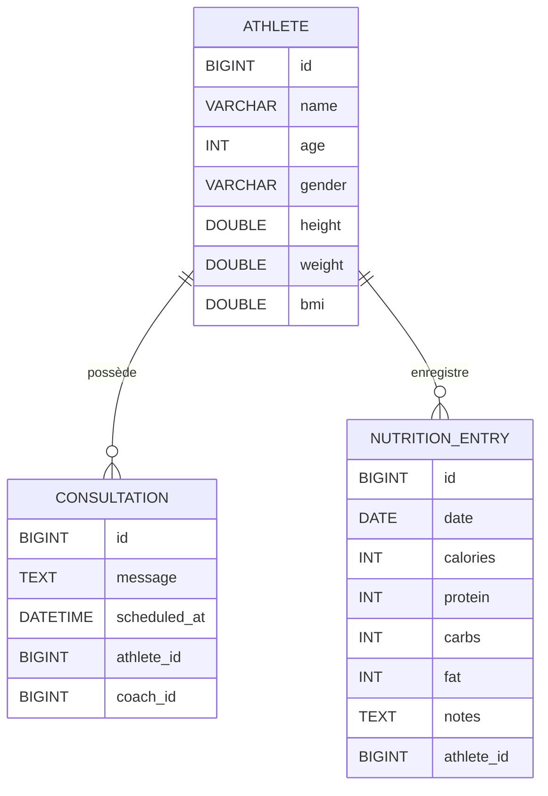
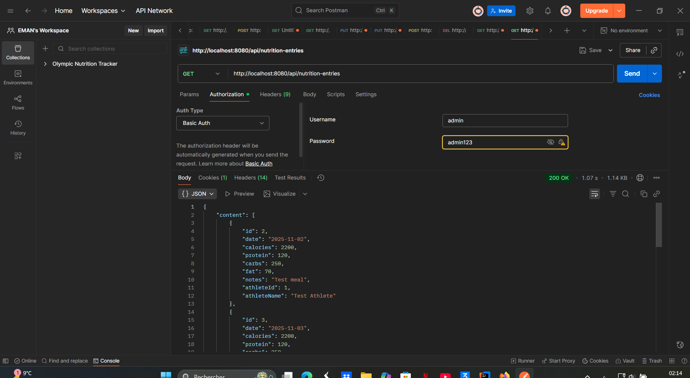
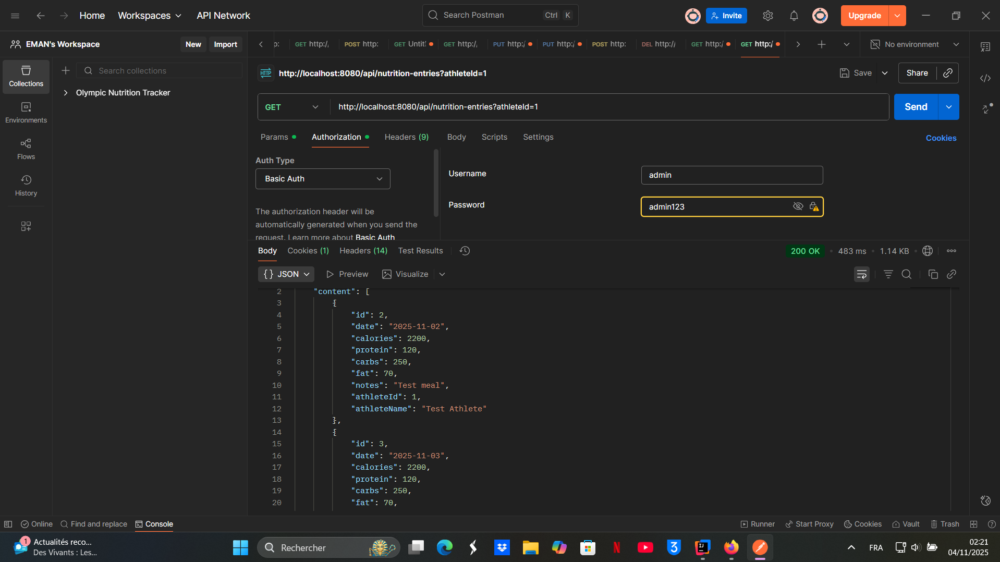
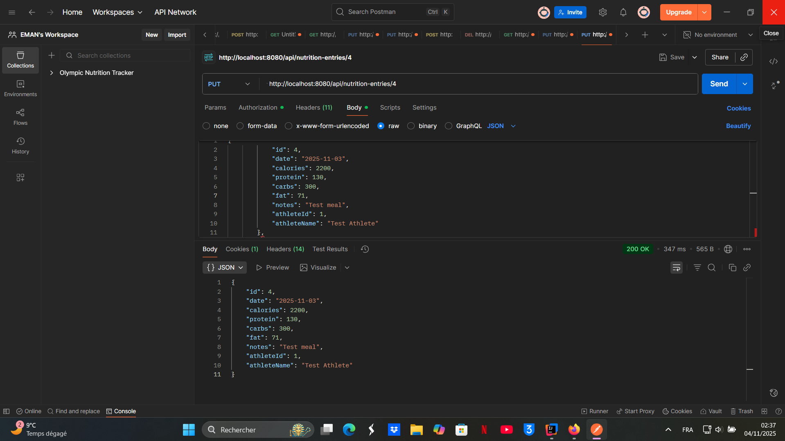
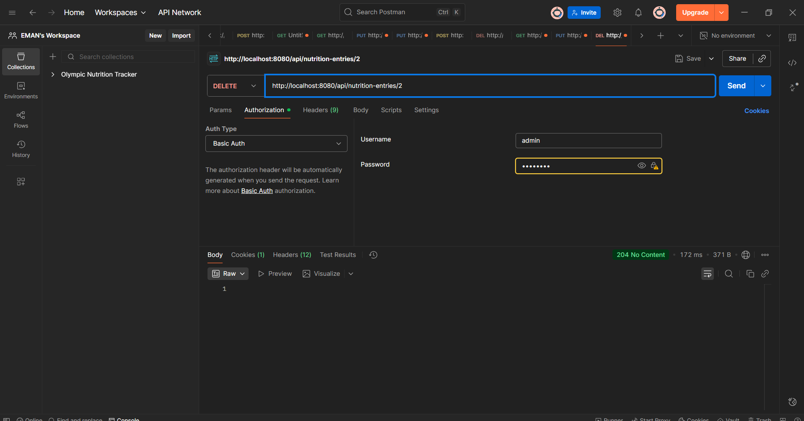

# 🏋️‍♀️ Olympic Nutrition Tracker

This is a **Spring Boot REST API** developed for the *Olympic Nutrition Tracker* project as part of **Bloc 3 – Studi 2025**.  
The application manages athletes' profiles and their daily nutrition entries, including BMI calculation and meal tracking.

---

## 🚀 Features

- Create, read, update and delete (CRUD) athletes
- Record and track daily nutrition entries
- Automatic BMI calculation
- MySQL database integration
- Tested using Postman

---

## 🛠️ Technologies Used

- **Java 21**
- **Spring Boot 3**
- **Spring Data JPA**
- **MySQL Database**
- **Lombok**
- **Postman (for API testing)**

---

## 🗂️ Project Structure

```
└── java/com/eman/tracker/olympicnutritiontracker/
    ├── model/
    │   ├── Athlete.java
    │   ├── Consultation.java
    │   ├── NutritionEntry.java
    ├── controller/
    │   ├── AthleteController.java
    │   ├── ConsultationController.java
    │   ├── NutritionEntryController.java
    ├── service/
    │   ├── AthleteService.java
    │   ├── ConsultationService.java
    │   ├── NutritionEntryService.java
    ├── repository/
    │   ├── AthleteRepository.java
    │   ├── ConsultationRepository.java
    │   ├── NutritionEntryRepository.java
    ├── dto/
    ├── mapper/
    └── OlympicNutritionTrackerApplication.java
```

---

## 🌐 API Endpoints

| Method | Endpoint | Description |
|---------|-----------|-------------|
| `GET` | `/api/athletes` | Retrieve all athletes |
| `POST` | `/api/athletes` | Create a new athlete |
| `PUT` | `/api/athletes/{id}` | Update an athlete |
| `DELETE` | `/api/athletes/{id}` | Delete an athlete |
| `GET` | `/api/consultations` | Retrieve all consultations |
| `POST` | `/api/consultations` | Create a new consultation |
| `PUT` | `/api/consultations/{id}` | Update a consultation |
| `DELETE` | `/api/consultations/{id}` | Delete a consultation |
| `GET` | `/api/nutrition-entries` | Retrieve all nutrition entries |
| `POST` | `/api/nutrition-entries` | Create a nutrition entry |
| `PUT` | `/api/nutrition-entries/{id}` | Update a nutrition entry |
| `DELETE` | `/api/nutrition-entries/{id}` | Delete a nutrition entry |
| `GET` | `/api/db-check` | Test database connection |

---

## 📊 Structure de la Base de Données (MySQL)

Le projet **Olympic Nutrition Tracker** utilise une base de données relationnelle MySQL pour stocker les informations des athlètes, des consultations et du suivi nutritionnel quotidien.  
Chaque table est reliée par des clés étrangères pour assurer l’intégrité des données.

---

### 🧍 Table `athletes`

| Champ | Type | Description |
|--------|------|-------------|
| `id` | BIGINT (PK) | Identifiant unique de l’athlète |
| `name` | VARCHAR(100) | Nom complet de l’athlète |
| `age` | INT | Âge de l’athlète |
| `gender` | VARCHAR(10) | Sexe (`Homme` / `Femme`) |
| `height` | DOUBLE | Taille en centimètres |
| `weight` | DOUBLE | Poids en kilogrammes |
| `bmi` | DOUBLE | Indice de masse corporelle (calculé automatiquement) |

🔗 **Relations :**
- Un `athlete` peut avoir plusieurs `nutrition_entries`
- Un `athlete` peut être lié à plusieurs `consultations`

---

### 💬 Table `consultations`

| Champ | Type | Description |
|--------|------|-------------|
| `id` | BIGINT (PK) | Identifiant unique de la consultation |
| `message` | TEXT | Commentaire ou description de la séance |
| `scheduled_at` | DATETIME | Date et heure de la consultation |
| `athlete_id` | BIGINT (FK) | Référence vers l’athlète concerné |
| `coach_id` | BIGINT (FK) | Référence vers le coach assigné |

🔗 **Relations :**
- Plusieurs `consultations` peuvent appartenir à un même `athlete`
- Chaque `consultation` est liée à un seul `coach`

---

### 🥗 Table `nutrition_entries`

| Champ | Type | Description |
|--------|------|-------------|
| `id` | BIGINT (PK) | Identifiant unique de l’entrée |
| `date` | DATE | Date du suivi alimentaire |
| `calories` | INT | Apport calorique total |
| `protein` | INT | Protéines (g) |
| `carbs` | INT | Glucides (g) |
| `fat` | INT | Lipides (g) |
| `notes` | TEXT | Notes ou observations |
| `athlete_id` | BIGINT (FK) | Référence vers l’athlète |

🔗 **Relations :**
- Plusieurs entrées peuvent appartenir à un même `athlete`
- Suppression en cascade si l’athlète est supprimé

---

### 🧠 Exemple de schéma simplifié



---

## 👩‍💻 Author

**Eman Altohami**  
Bachelor – Développeur Java, Studi (2025)

🔗 **GitHub Repository:**  
[https://github.com/eman-java-dev/OlympicNutritionTracker](https://github.com/eman-java-dev/OlympicNutritionTracker)

---

## 🏁 How to Run the Project

1. **Clone the repository**
   ```bash
   git clone https://github.com/eman-java-dev/OlympicNutritionTracker.git
   ```
2. **Open it in IntelliJ IDEA**
3. **Run the application**
4. **Access it from your browser or Postman:**  
   👉 [http://localhost:8080/api/athletes](http://localhost:8080/api/athletes)

> This backend was built for educational purposes as part of *Bloc 3 – Projet Final (Java Spring Boot)*.

---

## 📸 API Test Screenshots (Postman)

### 👟 Athletes

**POST /api/athletes**  


**GET /api/athletes**  


**PUT /api/athletes/{id}**  


**DELETE /api/athletes/{id}**  


---

### 💬 Consultations

**POST /api/consultations**  


**PUT /api/consultations/{id}**  


**GET /api/consultations**  


---

### 🥗 Nutrition Entries (Suivi nutritionnel)

> Toutes les requêtes Nutrition nécessitent une authentification **Basic Auth** (rôle : ADMIN ou COACH).

---

#### 1️⃣ GET — Récupérer toutes les entrées
**GET** `/api/nutrition-entries`  


#### 2️⃣ GET — Récupérer une entrée par ID
**GET** `/api/nutrition-entries/{id}`  
Exemple : `/api/nutrition-entries/1`  


#### 3️⃣ GET — Récupérer les entrées par Athlète
**GET** `/api/nutrition-entries?athleteId={athleteId}`  
Exemple : `/api/nutrition-entries?athleteId=1`  


#### 4️⃣ POST — Créer une nouvelle entrée
**POST** `/api/nutrition-entries`  
🧩 **Corps (JSON)** :
```json
{
  "athleteId": 1,
  "date": "2025-11-04",
  "calories": 2200,
  "protein": 120,
  "carbs": 250,
  "fat": 60,
  "notes": "Création d'une nouvelle entrée via Postman"
}
```

#### 5️⃣ PUT — Mettre à jour une entrée
**PUT** `/api/nutrition-entries/{id}`  

```json
{
  "athleteId": 1,
  "date": "2025-11-04",
  "calories": 2300,
  "protein": 125,
  "carbs": 255,
  "fat": 62,
  "notes": "Mise à jour après le déjeuner"
}
```

#### 6️⃣ DELETE — Supprimer une entrée
**DELETE** `/api/nutrition-entries/{id}`  


---

🧩 **Note**  
This backend was built for educational purposes as part of **Bloc 3 – Projet Final (Java Spring Boot)** at Studi.
