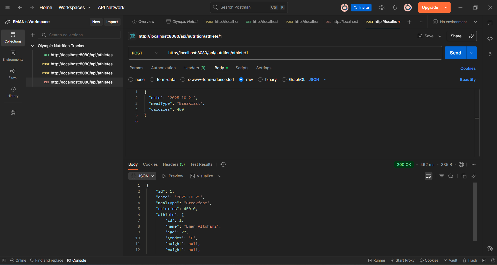
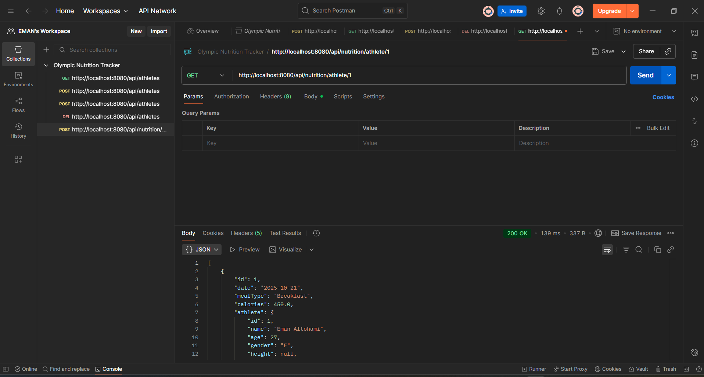
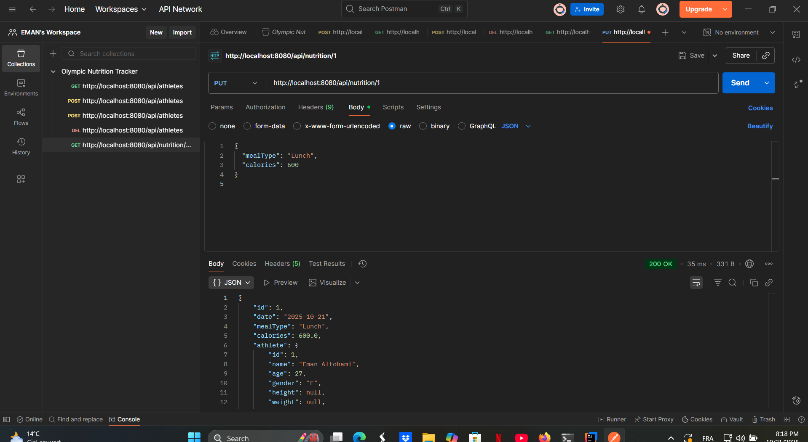
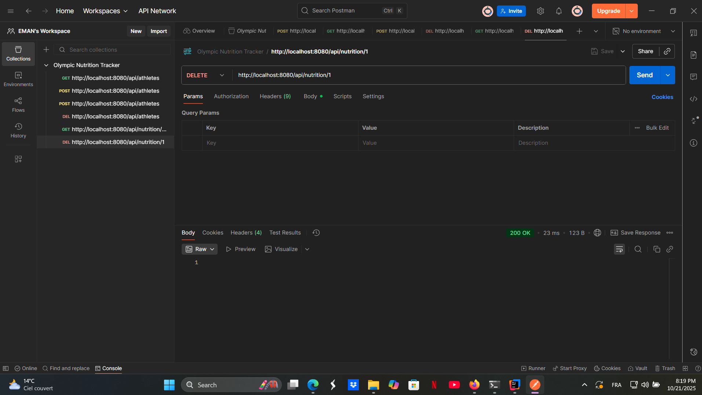
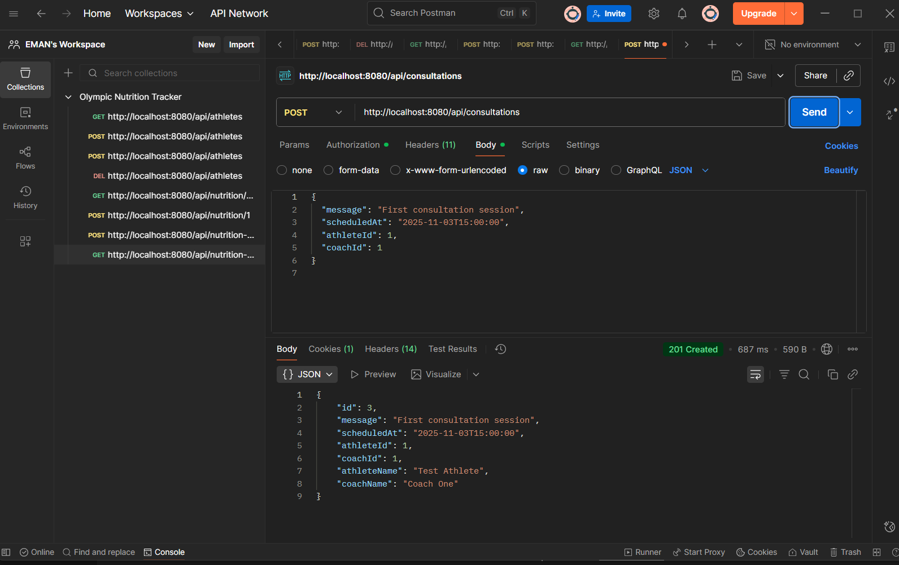
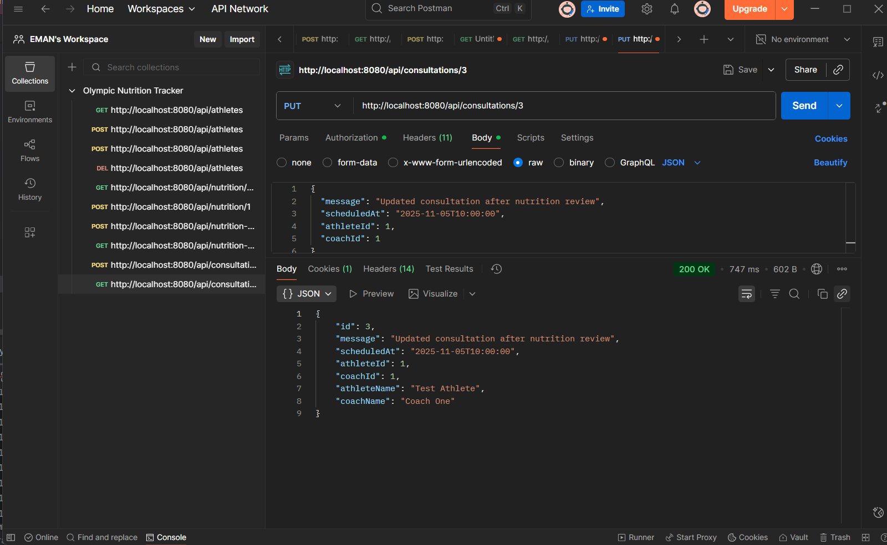
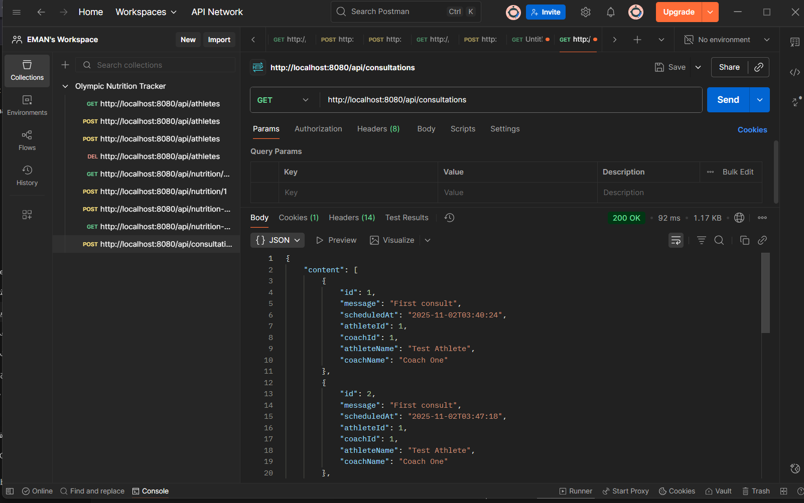
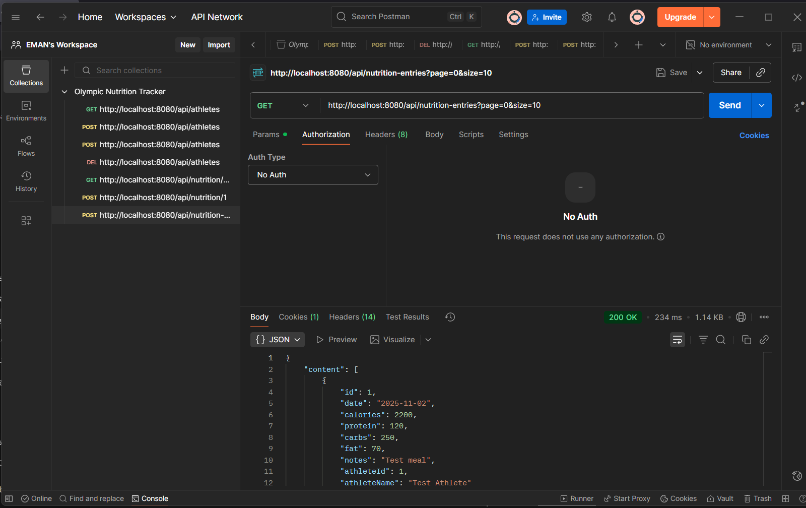
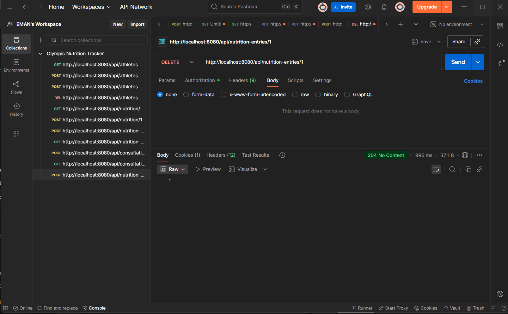

#  Olympic Nutrition Tracker

This is a **Spring Boot REST API** developed for the *Olympic Nutrition Tracker* project as part of **Bloc 3 – Studi 2025**.

The application manages athletes' profiles and their daily nutrition entries, including BMI calculation and meal tracking.

---

##  Features

- Create, read, update and delete (CRUD) athletes  
- Record and track daily nutrition entries  
- Automatic BMI calculation  
- MySQL database integration  
- Tested using Postman  

---

##  Technologies Used

- **Java 21**
- **Spring Boot 3**
- **Spring Data JPA**
- **MySQL Database**
- **Lombok**
- **Postman (for API testing)**

---

## 🗂️ Project Structure


└── main/
└── java/com/eman/tracker/olympicnutritiontracker/
├── Athlete.java
├── AthleteController.java
├── AthleteService.java
├── AthleteRepository.java
├── NutritionEntry.java
├── NutritionEntryController.java
├── NutritionEntryService.java
├── dto/
├── mapper/
└── OlympicNutritionTrackerApplication.java

---

##  API Endpoints

| Method | Endpoint | Description |
|---------|-----------|-------------|
| `GET` | `/api/athletes` | Get all athletes |
| `POST` | `/api/athletes` | Create new athlete |
| `PUT` | `/api/athletes/{id}` | Update athlete by ID |
| `DELETE` | `/api/athletes/{id}` | Delete athlete by ID |
| `GET` | `/api/db-check` | Check database connection |

---

##  Author

**Eman Altohami**  
Bachelor – Développeur Java, Studi (2025)

GitHub Repository:  
 [https://github.com/eman-java-dev/OlympicNutritionTracker](https://github.com/eman-java-dev/OlympicNutritionTracker)

---

## 🏁 How to Run the Project

1. Clone the repository:
   ```bash
   git clone https://github.com/eman-java-dev/OlympicNutritionTracker.git

2.Open it in IntelliJ IDEA

3.Run the application

4.Access it from your browser or Postman

http://localhost:8080/api/athletes
This backend was built for educational purposes as part of Bloc 3 (Projet Final – Java Spring Boot).

---

 📸 API Test Screenshots (Postman)

Below are examples of API tests performed using Postman.
### 👟 Athletes

###   (POST /api/athletes)


###  Get All Athletes (GET /api/athletes)


###  Update Athlete (PUT /api/athletes/{id})


###  Delete Athlete (DELETE /api/athletes/{id})


###  Consultations
- **POST /api/consultations**  
  

- **PUT /api/consultations/{id}**  
  

- **GET /api/consultations**  
  

---

###  Nutrition Entries
- **POST /api/nutrition-entries**  
  

- **GET /api/nutrition-entries**  
  

- **DELETE /api/nutrition-entries/{id}**  
  
